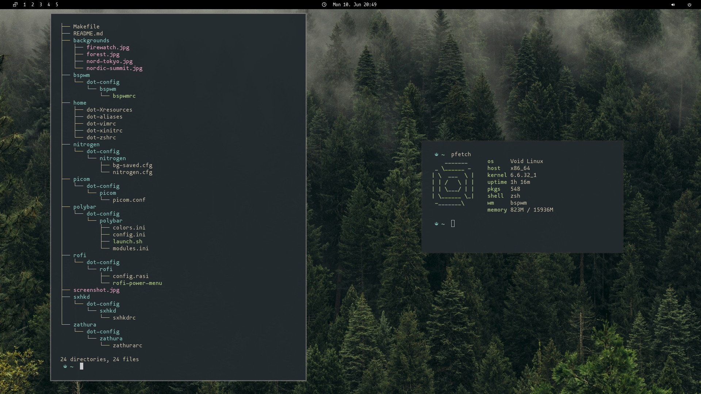

# Dotfiles

Usage:
- `make` or `make minimal` — install minimal dotfiles
- `make window-manager` — install window manager configs
- `make full` — install both minimal and window manager
- `make delete` — remove all installed dotfiles

