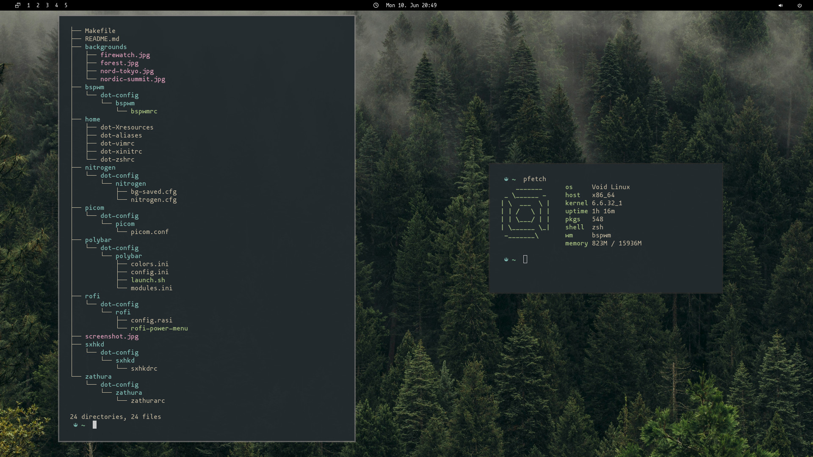

# Dotfiles

## Usage

- `make` or `make minimal` — install minimal dotfiles
- `make window-manager` — install window manager configs
- `make full` — install both minimal and window manager
- `make delete` — remove all installed dotfiles
- `make link` — only re-link the dotfiles (no sudo, no apt); use it after editing or adding files

## Font

The icons in polybar, rofi and the terminal need **Mononoki Nerd Font**. It
has no Debian package, so install it by hand: download `Mononoki.zip` from
https://github.com/ryanoasis/nerd-fonts/releases, unzip it into
`~/.local/share/fonts` and run `fc-cache -f`.

