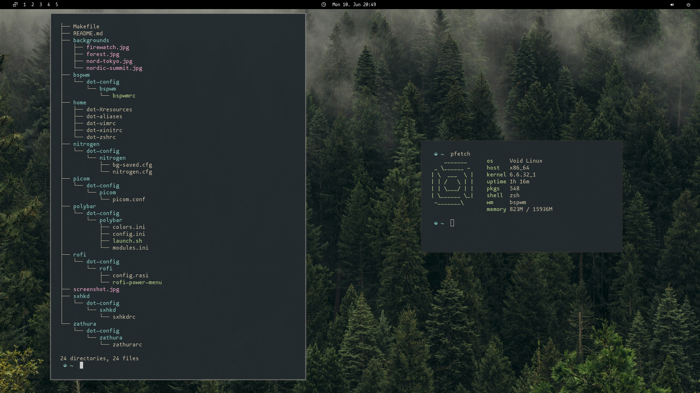

# Dotfiles

Usage: Go to the ``minimal`` directory and execute ``make`` to install and ``make delete`` to uninstall dotfiles. For a window-manager only setup also execute make inside the ``window-manager`` directory.

